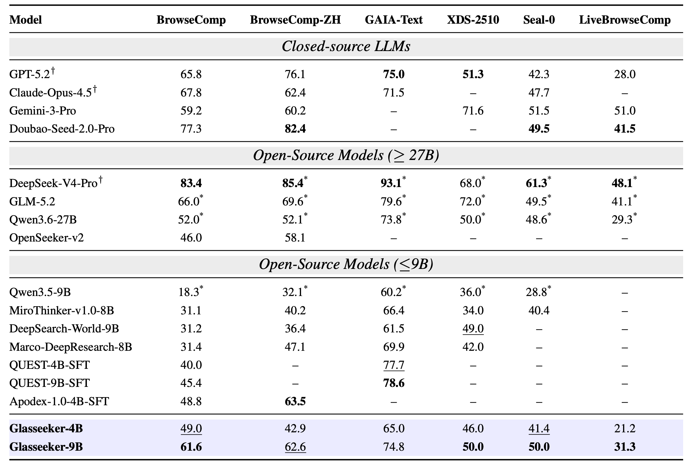
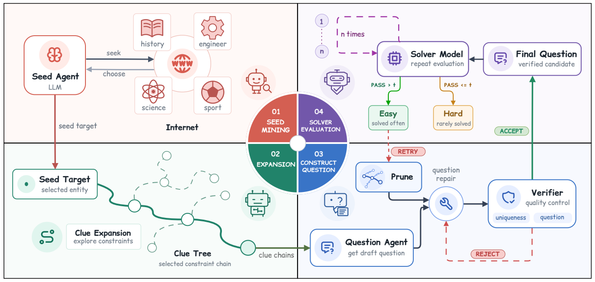
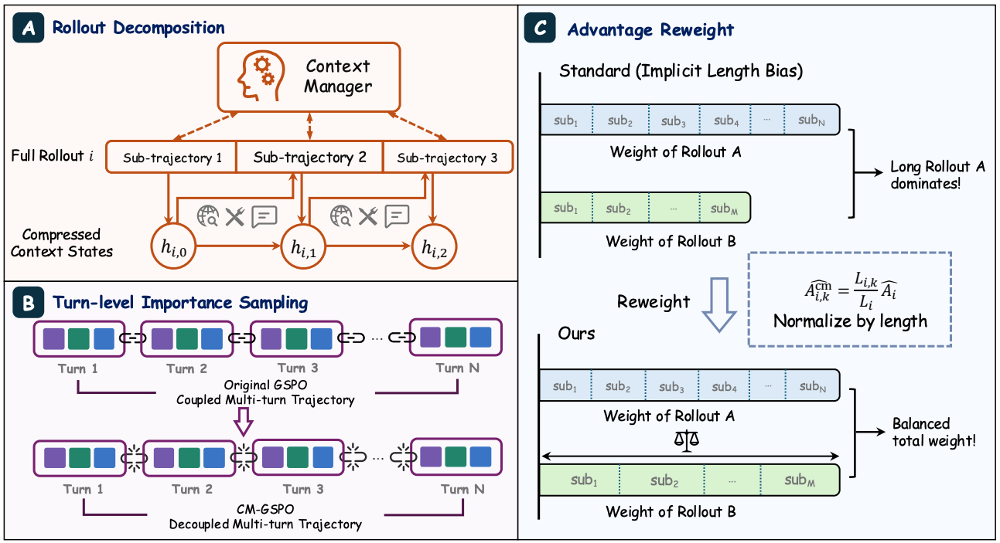

# Glasseek

### A Transparent Recipe for Training and Trustworthy Evaluation of Deep Search Agents

**Verifiable data. Compaction-aware RL. Trustworthy evaluation.**

[][paper]
[][models]
[][datasets]

[Overview](#overview) · [Results](#results) · [Method](#method) · [Resources](#resources) · [Repository](#repository) · [Citation](#citation)

Official repository for **Glasseek**, a framework for building deep search agents through verifiable data construction, reinforcement learning with context management, and evaluation with anti-leakage safeguards. Our **Glasseeker-4B** and **Glasseeker-9B** models are built on Qwen3.5-4B and Qwen3.5-9B.

> **Release status:** This repository currently contains the project overview and directory structure. Code, model weights, and datasets are being prepared for release.

## Overview

Deep search requires agents to plan queries, explore the web, verify evidence, and reason across long interaction histories. Glasseek addresses three challenges across this workflow:

| Challenge | Our approach |
| :--- | :--- |
| Search data is difficult to audit and reproduce. | A verifiable construction pipeline with evidence-grounded clues, question repair, uniqueness checks, and difficulty evaluation. |
| Context compaction changes the histories used for policy optimization. | **Compaction-Managed GSPO (CM-GSPO)** applies importance correction to conditioned sub-trajectories and reweights their contributions within each rollout. |
| Web-enabled agents can retrieve benchmark answers during evaluation. | A modular evaluation guardrail filters benchmark-related queries, results, and URLs, and restricts access to local answer files. |

## Results

Performance (%) reported in **Table 2 of the current manuscript**. Higher is better.

  

Full comparison from the manuscript. Click the table to view it at full resolution.

**Reading the table:** Results marked with **†** are quoted from the corresponding technical reports; unmarked model rows were evaluated with our Deep Search Agent. A dash indicates an unreported result. Grouping, emphasis, and superscript markers are reproduced from the manuscript.

The six benchmarks cover English and Chinese web search, text-based agent tasks, reasoning with noisy evidence, and live browsing. **GAIA-Text** is the 103-question text-only subset; **XDS-2510** denotes the 2510 version of xbench-DeepSearch.

Results describe the research models in the manuscript; checkpoints and reproduction instructions are forthcoming. Detailed evaluation settings will be available with the paper.

<strong>Training ablation: from SFT to CM-GSPO</strong>

Table 3 of the manuscript compares training strategies for the 9B model. BrowseComp ablations use a 200-question subset and are averaged over three independent runs, as described in Section 5.3.

| Training strategy | BrowseComp | BrowseComp-ZH | Seal-0 | XBench | GAIA-Text |
| :--- | ---: | ---: | ---: | ---: | ---: |
| SFT baseline | 55.5 | 59.5 | 34.2 | 44.0 | 63.1 |
| Vanilla GSPO | 47.0 | 51.2 | 41.4 | 47.0 | 66.0 |
| GSPO + Compaction RL | 55.0 | 55.7 | 42.3 | 48.0 | 65.0 |
| **CM-GSPO** | **61.6** | **62.6** | **50.0** | **50.0** | **74.8** |

CM-GSPO improves on the SFT baseline across all five reported benchmarks, including **+15.8 percentage points on Seal-0** and **+11.7 on GAIA-Text**.

## Method

### 1. Verifiable data construction

  

The pipeline builds questions around source-supported seed targets and indirect clue chains:

1. **Mine diverse seeds.** Identify uncommon targets across domains and record their answers and supporting sources.
2. **Expand constraints.** Construct evidence-grounded clue trees whose combined constraints identify the target, with distractors to introduce plausible alternative search directions.
3. **Construct, repair, and verify.** Assemble questions from selected clue chains, search for competing answers, and verify that the intended answer can be recovered from evidence.
4. **Evaluate difficulty.** Use repeated solver attempts to estimate difficulty, then refine overly revealing or insufficient clues.

### 2. Compaction-Managed GSPO

  

Long search rollouts can exceed the context window. When a context manager compresses the history, subsequent actions are conditioned on a new context state. CM-GSPO incorporates these boundaries into policy optimization:

- **Conditioned sub-trajectories:** split each rollout at compaction boundaries and retain the context used to generate each segment.
- **Importance correction:** compute length-normalized sequence ratios within sub-trajectories using their corresponding conditioning contexts.
- **Rollout-consistent weighting:** share the terminal reward across segments and scale each segment's advantage by its effective token length relative to the original rollout.

Together, these components support policy updates over long interactions while preserving the original rollout's total weight.

### 3. Trustworthy evaluation

Our evaluation setup builds on [Hermes Agent](https://github.com/nousresearch/hermes-agent), with web search through [Serper](https://serper.dev/) and page retrieval through [Jina Reader](https://jina.ai/reader/).

The anti-leakage guardrail operates at the tool boundary:

- **Search:** filter benchmark-identifying queries and known leakage sources in returned results.
- **Page retrieval:** block benchmark-hosting URLs and paths that expose evaluation artifacts.
- **Execution:** restrict file-system access to prevent reading local reference answers.

Trajectory audits combine rule-based detection with an LLM judge to identify actual exposure to benchmark content. These safeguards address **external, tool-mediated leakage**; knowledge already stored in model weights is a separate evaluation concern.

## Resources

Public links will be added here as each artifact is released.

| Resource | Description | Link |
| :--- | :--- | :--- |
| Paper | Glasseek: A Transparent Recipe for Training and Trustworthy Evaluation of Deep Search Agents | arXiv: coming soon |
| Glasseeker-4B | Research model based on Qwen3.5-4B | Hugging Face: coming soon |
| Glasseeker-9B | Research model based on Qwen3.5-9B | Hugging Face: coming soon |
| Training data | Curated questions and search trajectories | Hugging Face Datasets: coming soon |

### Release roadmap

- [x] Project overview and repository structure
- [ ] arXiv preprint and citation metadata
- [ ] Data construction pipeline and training datasets
- [ ] Model checkpoints and model cards
- [ ] SFT recipes and CM-GSPO training code
- [ ] Evaluation harness, backend tools, and anti-leakage guardrails
- [ ] Installation, inference, training, and evaluation instructions

## Repository

The current directories reserve space for the following components; implementation files and usage instructions will accompany the code release.

| Directory | Planned contents |
| :--- | :--- |
| [`Data_curation/`](Data_curation/) | Seed mining, clue construction, verification, and difficulty evaluation |
| [`RL_training/`](RL_training/) | CM-GSPO training code and configurations |
| [`Evaluation/`](Evaluation/) | Benchmark runners, evaluation configurations, and reporting |
| [`Evaluation_backend/`](Evaluation_backend/) | Tool services and evaluation safeguards |

## Citation

The arXiv link and BibTeX entry will be added when the preprint is available.

<!-- Release links: replace these anchors with the published arXiv abstract,
     Hugging Face model collection, and Hugging Face dataset URLs.
     Keep "coming soon" labels until the corresponding artifacts are public. -->
[paper]: #resources
[models]: #resources
[datasets]: #resources
